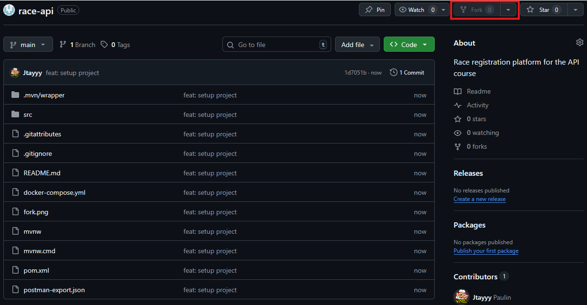

# 👩‍💻 Yousra Ameur — Groupe SNI1

# TP — Création d'une API REST : Gestion d'inscriptions à une course

## Objectif

L'objectif de ce TP est de concevoir et développer une **API REST** permettant de gérer l'inscription de coureurs à différentes courses.

Cette API devra permettre :

* de gérer les **coureurs**
* de gérer les **courses**
* de gérer les **inscriptions à une course**

Les données devront être **persistées dans une base de données PostgreSQL**.

---

# Contexte

Une organisation sportive souhaite mettre en place une plateforme permettant de gérer les inscriptions à différentes courses.

Chaque **coureur** peut s'inscrire à **plusieurs courses**, et chaque **course** peut accueillir **plusieurs coureurs**.

L’API a été développée afin de répondre à ce besoin en permettant la gestion complète des coureurs, des courses et des inscriptions.

---

# Stack technique

Pour ce TP, vous utiliserez les technologies suivantes :

* **Java 25**
* **Spring Boot 4**
* **Spring Web**
* **Spring Data JPA**
* **Flyway**


* **Docker**
* **PostgreSQL**
* **Adminer**

---

# Fork le projet

Avant de commencer le TP, forkez le projet pour avoir votre propre repo associé au TP :


Clonez ensuite le projet **depuis votre repo**

---

# Lancer le projet

## 1 — Démarrer la base de données

Pour lancer votre base de données SQL et Adminer :

```bash
docker compose up -d
```

(vous devez avoir lancé Docker Desktop au préalable si vous êtes sur Windows)

---

## 2 — Accéder à Adminer

Adminer permet de visualiser la base de données.

URL :

```
http://localhost:8081
```

Paramètres de connexion :

| Champ    | Valeur        |
| -------- |---------------|
| System   | PostgreSQL    |
| Server   | race_postgres |
| Username | race          |
| Password | race          |
| Database | race_db       |

---

## 3 — Lancer l'application

Lancer votre configuration directement sur IntelliJ.

Sinon, depuis votre IDE ou en ligne de commande :

```bash
mvn spring-boot:run
```

L'API sera disponible sur :

```
http://localhost:8080
```

---

# Modèle de données

L'application repose sur trois entités principales.

## Runner (Coureur)

| Champ     | Type    | Description        |
| --------- | ------- | ------------------ |
| id        | Long    | identifiant unique |
| firstName | String  | prénom             |
| lastName  | String  | nom                |
| email     | String  | email              |
| age       | Integer | âge                |

---

## Race (Course)

| Champ           | Type    | Description                    |
| --------------- | ------- | ------------------------------ |
| id              | Long    | identifiant                    |
| name            | String  | nom de la course               |
| date            | Date    | date de la course              |
| location        | String  | lieu                           |
| maxParticipants | Integer | nombre maximum de participants |

---

## Registration (Inscription)

| Champ            | Type | Description              |
| ---------------- | ---- | ------------------------ |
| id               | Long | identifiant              |
| runnerId         | Long | identifiant du coureur   |
| raceId           | Long | identifiant de la course |
| registrationDate | Date | date d'inscription       |

---

# API à implémenter

## Gestion des coureurs

### Lister les coureurs

```
GET /runners
```

---

### Récupérer un coureur

```
GET /runners/{id}
```

Si le coureur n'existe pas :

```
404 Not Found
```

---

### Supprimer un coureur

```
DELETE /runners/{id}
```

---

### Créer un coureur

```
POST /runners
```

Body :

```json
{
  "firstName": "Alice",
  "lastName": "Martin",
  "email": "alice.martin@example.com",
  "age": 30
}
```

Réponse attendue :

```
201 Created
```

---

### Modifier un coureur

```
PUT /runners/{id}
```

Body :

```json
{
  "firstName": "Alice",
  "lastName": "Martin",
  "email": "alice.martin@example.com",
  "age": 31
}
```

Réponse attendue :

```
201 Created
```

---

Si le coureur n'existe pas :

```
404 Not Found
```

---

# Gestion des courses

### Lister les courses

```
GET /races
```

---

### Récupérer une course

```
GET /races/{id}
```

---

### Créer une course

```
POST /races
```

Body :

```json
{
  "name": "Semi-marathon de Paris",
  "date": "2026-06-01",
  "location": "Paris",
  "maxParticipants": 500
}
```

---

### Compter le nombre de participants d'une course

GET /races/{raceId}/participants/count

Réponse :

```json
{
  "count": 42
}
```

Si la course n'existe pas :

```
404 Not Found
```

---

# Gestion des inscriptions

### Inscrire un coureur à une course

```
POST /races/{raceId}/registrations
```

Body :

```json
{
  "runnerId": 1
}
```

Réponse :

```
201 Created
```

---

### Lister les participants d'une course

```
GET /races/{raceId}/registrations
```

---

### Lister les courses d'un coureur

```
GET /runners/{runnerId}/races
```

---

# Règles métier

Votre API doit respecter les règles suivantes :

### Un coureur ne peut pas être inscrit deux fois à la même course

Si cela arrive :

```
409 Conflict
```

---

### Les coureurs doivent avoir une adresse mail correcte

Si un **mail** ne continent pas de @ :

```
400 Bad Request
```

---

### Une course ne peut pas dépasser son nombre maximum de participants

Si la course est complète :

```
409 Conflict
```

---

### Les ressources doivent exister

Si un **runner** ou une **race** n'existe pas :

```
404 Not Found
```

---

# Codes HTTP attendus

| Code | Signification         |
| ---- | --------------------- |
| 200  | Succès                |
| 201  | Ressource créée       |
| 400  | Requête invalide      |
| 404  | Ressource non trouvée |
| 409  | Conflit               |

---

# Conseils

* Implémentez l'API **progressivement**
* Testez vos endpoints avec Postman
* Vérifiez les données directement dans **Adminer**

---

# Bonus 

J'ai  ajouté un filtre 
sur le location pour le endpoint de récupération des courses

## Filtrage

```
GET /races?location=Paris
```

---

---

##  Tests

Les endpoints ont été testés avec **Postman**.

Les données ont été vérifiées via **Adminer**.

Tests réalisés :
- création de runners et races
- inscription des coureurs aux courses
- vérification du nombre de participants
- test des règles métier (409, 404, 400)

---

##  Implémentation

L’API a été développée progressivement :

1. mise en place de la gestion des runners (CRUD)
2. mise en place de la gestion des races
3. implémentation des inscriptions (registrations)
4. ajout des règles métier (validation email, limite de participants, doublons)
5. ajout du bonus : filtrage des courses par localisation
